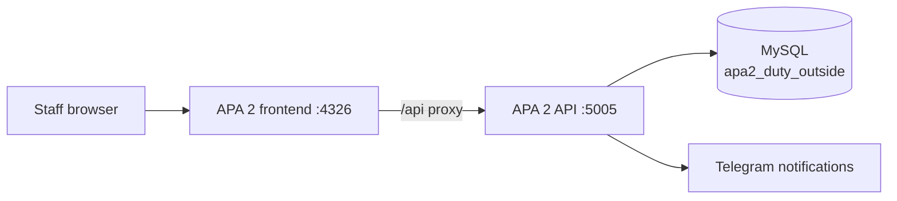

# APA 2 - Duty Outside request flow

```mermaid
flowchart LR
    Staff[Staff browser] --> Frontend[APA 2 frontend :4326]
    Frontend -->|/api proxy| Backend[APA 2 API :5005]
    Backend --> DB[(MySQL<br/>apa2_duty_outside)]
    Backend --> Telegram[Telegram notifications]
```
